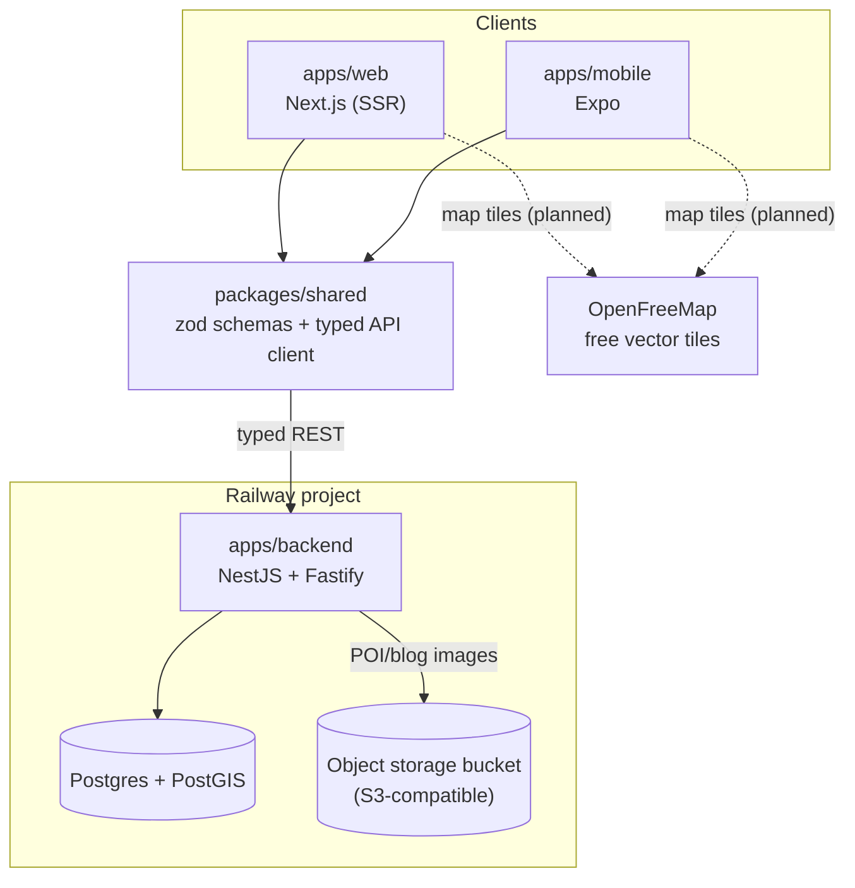

# MuslimSpaces

Helps Muslims in Romania find points of interest — mosques, halal
restaurants, Islamic learning centers, doctors/services — on a map.

Full architecture rules, data model, and practices live in
[`CLAUDE.md`](./CLAUDE.md). This file is the quicker orientation: what's
here, how it fits together, how to run it.

## Architecture



Solid lines are built and verified end to end. Dashed lines are decided
architecture that isn't wired up yet (see [Status](#status)).

Everything backend-side runs on Railway as separate services in one project
— `web`, `backend`, `postgres`, and a standalone object storage bucket. No
other paid third-party service. See `CLAUDE.md` for the full reasoning
behind each stack choice (NestJS+Fastify, REST+zod over tRPC, TypeORM over
Prisma, MapLibre+OpenFreeMap over Mapbox, bucket over volume).

## Monorepo layout

```
apps/
  backend/   NestJS + Fastify API — auth, POI/category CRUD, geospatial
             queries, hours/openNow, images, favorites, reviews, blog, media
  web/       Next.js — SSR POI list, login, authenticated account page
  mobile/    Expo — shares types with the backend, same POI list
packages/
  shared/    zod schemas + typed API client, imported by web, mobile, and backend
  ui/        placeholder for design tokens/components shared across RN + web
```

## Status

**Built and verified against a live backend + PostGIS + MinIO (S3-compatible) stack:**
- Auth: signup/login/me, preferred-locale update (argon2, JWT)
- Categories as many-to-many tags with a designated primary (a POI can be
  Mosque + Jamiah at once), cities, POI CRUD with a moderation workflow
  (pending → approved/rejected, public endpoints only ever return approved)
- Geospatial queries: radius search, nearest, bounding-box (map viewport),
  all filterable by category and `openNow`
- Structured opening hours (`poi_hours`) powering the `openNow` filter
- POI images (logo/cover/gallery) and a generic media upload endpoint —
  `sharp` resize to WebP thumbnail+display variants, stored in an
  S3-compatible bucket
- Favorites (save/list a user's POIs)
- Reviews: open to everyone, rate-limited (10/hour/user) instead of
  pre-moderated, with a denormalized rating average/count on each POI
- A minimal blog (markdown content per locale, draft/published, cover image)
- Web: SSR POI list, login flow, authenticated account page
- Mobile: POI list screen sharing types with the backend

**Decided but not yet implemented:**
- Map screens (MapLibre GL + OpenFreeMap vector tiles)
- Web/mobile UI for the newer features (categories-as-tags display,
  reviews, favorites, blog, hours, image upload) — the backend API and
  shared client exist; the UI hasn't caught up yet

## Getting started

Prerequisites: Node 20+ (Expo's CLI needs **20.19.4+** specifically — see
`CLAUDE.md`), and Docker for a local Postgres+PostGIS instance.

```bash
corepack enable
pnpm install

# local Postgres+PostGIS (any Docker Postgres+PostGIS image works)
docker run --name muslimspaces-postgres \
  -e POSTGRES_PASSWORD=postgres -e POSTGRES_DB=muslimspaces \
  -p 5433:5432 -d postgis/postgis:16-3.4

# local S3-compatible bucket for the media/photo pipeline (use quay.io,
# not Docker Hub's deprecated minio/minio — see CLAUDE.md)
docker run --name muslimspaces-minio \
  -e MINIO_ROOT_USER=minioadmin -e MINIO_ROOT_PASSWORD=minioadmin \
  -p 9000:9000 -p 9001:9001 -d quay.io/minio/minio server /data --console-address ":9001"
docker run --rm --network host --entrypoint sh quay.io/minio/mc -c \
  "mc alias set local http://localhost:9000 minioadmin minioadmin && \
   mc mb local/muslimspaces-media && mc anonymous set download local/muslimspaces-media"

cp apps/backend/.env.example apps/backend/.env   # points at both containers above
cp apps/web/.env.local.example apps/web/.env.local
cp apps/mobile/.env.example apps/mobile/.env

pnpm --filter backend migration:run   # schema + PostGIS extension + seed categories
pnpm dev                              # backend (:3001) + web (:3000) via turbo
```

Mobile runs separately (needs its own Node version, see above):

```bash
cd apps/mobile && pnpm dev
```

## Deployment

Railway, one project, multiple services (`web`, `backend`, `postgres`,
bucket). Each app service has its own `Dockerfile`
(`apps/backend/Dockerfile`, `apps/web/Dockerfile`) but the **build context /
root directory must stay the repo root** — pnpm workspaces need
`pnpm-workspace.yaml` and `packages/*` present to resolve `workspace:*`
dependencies. Full details in `CLAUDE.md`.
